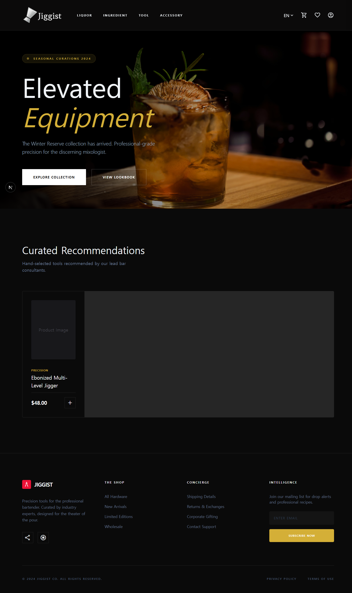
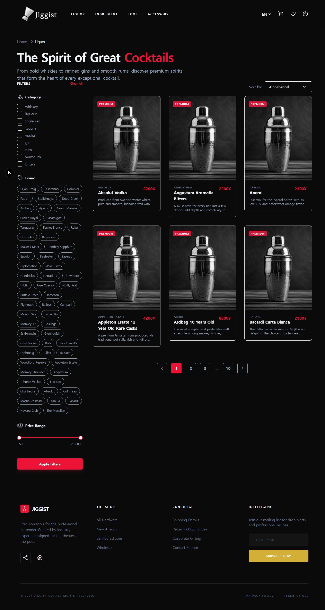
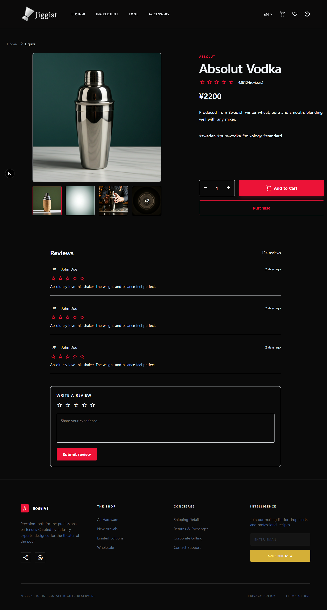
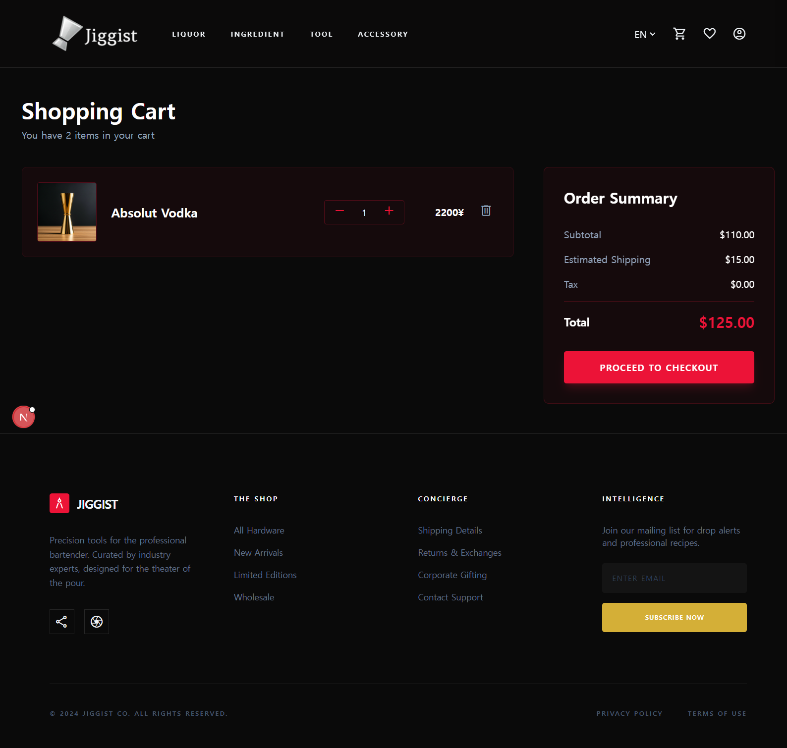
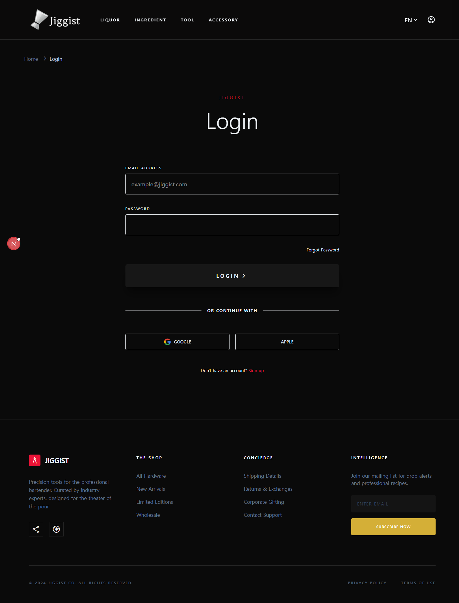
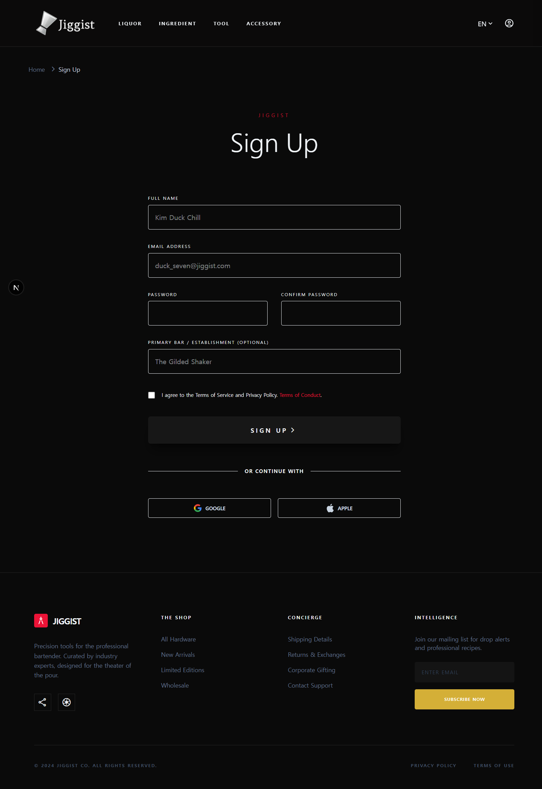

# 🍸 Bartender向けECサイト（中断）
バーテンダー向けに、ツール・材料・スピリッツなどを検索・購入できるモダンなECアプリです。

---

## 成果物画像（20260404基準）







---

## 技術スタック
* Frontend: Next.js（App Router）, TypeScript
* Styling: Tailwind CSS
* Backend: Firebase（Firestore, Authentication）
* i18n: next-intl

---

## 主な機能
* ユーザー認証（Firebase Authentication）
* カート機能（商品追加・数量管理）
* 多言語対応（英語 / 日本語 / 韓国語）
* 商品フィルタリング・ソート機能
* Firestoreベースのデータ設計

---

## アーキテクチャ
* Server ComponentとClient Componentの役割分離
* Repositoryパターンによるデータアクセスの抽象化
* カート機能はFirebase Client SDKを利用
* 認証およびセキュア処理はServer Actionで管理

---

## データ構造
```
USERS/{userId}/CART_ITEMS/{productId}
PRODUCTS/{productId}
```

---

## 工夫した点
### 1. サーバーコンポーネントとクライアントコンポーネントの使い分け
* 商品目録画面を実装するとき、ページをクライアントコンポーネントにして問題を解決したいと思ったりしましたが、SEOが大事なページなため、データのfetchはサーバーで処理するように工夫しました。
* また、基本方針として、ページ内の要素を細かく分け、それぞれでクライアントコンポーネントの機能が必要なものだけクライアントコンポーネントとするようにしました。

### 2. データ構造
* NoSQLを初めて経験しましたが、機能ごとに一気に呼び出す必要があるデータは何かを意識してDBを設計しました。

---

## セットアップ
```bash
yarn install
yarn dev
```

---

## 環境変数
```
NEXT_PUBLIC_FIREBASE_API_KEY=
NEXT_PUBLIC_FIREBASE_AUTH_DOMAIN=
NEXT_PUBLIC_FIREBASE_PROJECT_ID=
FIREBASE_CLIENT_EMAIL=
FIREBASE_PRIVATE_KEY=
```

---

## プロジェクト中断理由
* 他のプロジェクトを新しく始めることになったため

---
